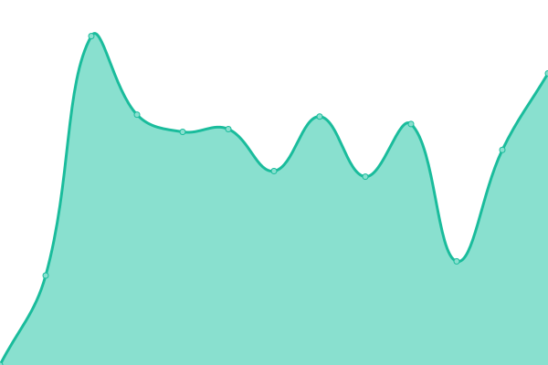
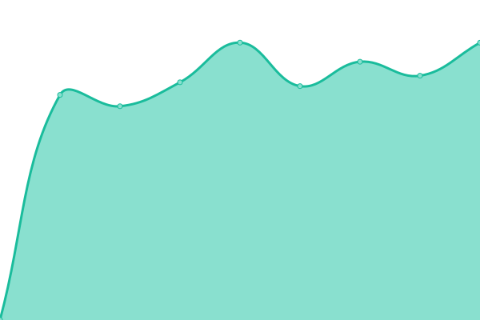
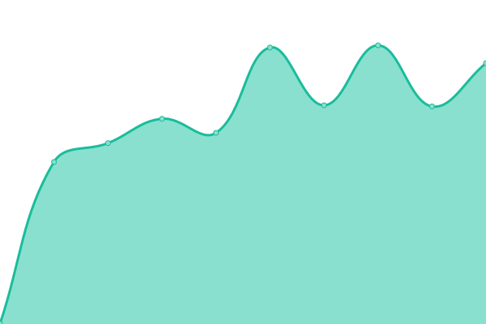
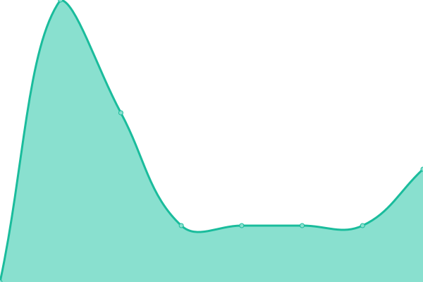

# [📈 Live Status](https://kharloss.github.io/monitorizare_websites): <!--live status--> **🟧 Partial outage**

This repository contains the open-source uptime monitor and status page for [kharloss](https://kharloss.github.io/monitorizare_websites), powered by [Upptime](https://github.com/upptime/upptime).

With [Upptime](https://upptime.js.org), you can get your own unlimited and free uptime monitor and status page, powered entirely by a GitHub repository. We use [Issues](https://github.com/kharloss/monitorizare_websites/issues) as incident reports, [Actions](https://github.com/kharloss/monitorizare_websites/actions) as uptime monitors, and [Pages](https://kharloss.github.io/monitorizare_websites) for the status page.

<!--start: status pages-->
<!-- This summary is generated by Upptime (https://github.com/upptime/upptime) -->
<!-- Do not edit this manually, your changes will be overwritten -->
<!-- prettier-ignore -->
| URL | Status | History | Response Time | Uptime |
| --- | ------ | ------- | ------------- | ------ |
|  [Trioserv](https://www.trioserv.ro) | 🟩 Up | [trioserv.yml](https://github.com/kharloss/monitorizare_websites/commits/HEAD/history/trioserv.yml) | 

 1388ms
     
 | 

<a href="https://kharloss.github.io/monitorizare_websites/history/trioserv">100.00%</a>
    

|  [Apanova](https://www.apanovabucuresti.ro) | 🟩 Up | [apanova.yml](https://github.com/kharloss/monitorizare_websites/commits/HEAD/history/apanova.yml) | 

 842ms
     
 | 

<a href="https://kharloss.github.io/monitorizare_websites/history/apanova">100.00%</a>
    

|  [Trady](https://www.trady.ro) | 🟥 Down | [trady.yml](https://github.com/kharloss/monitorizare_websites/commits/HEAD/history/trady.yml) | 

 0ms
     
 | 

<a href="https://kharloss.github.io/monitorizare_websites/history/trady">100.00%</a>
    

|  [Fvideo](https://www.fvideo.ro) | 🟩 Up | [fvideo.yml](https://github.com/kharloss/monitorizare_websites/commits/HEAD/history/fvideo.yml) | 

 2814ms
     
 | 

<a href="https://kharloss.github.io/monitorizare_websites/history/fvideo">100.00%</a>
    

|  [Trioserv n8n](https://n8n-production-3916.up.railway.app) | 🟥 Down | [trioserv-n8n.yml](https://github.com/kharloss/monitorizare_websites/commits/HEAD/history/trioserv-n8n.yml) | 

 308ms
     
 | 

<a href="https://kharloss.github.io/monitorizare_websites/history/trioserv-n8n">0.00%</a>
    

|  [Google DNS 1](8.8.4.4) | 🟥 Down | [google-dns-1.yml](https://github.com/kharloss/monitorizare_websites/commits/HEAD/history/google-dns-1.yml) | 

 2ms
     
 | 

<a href="https://kharloss.github.io/monitorizare_websites/history/google-dns-1">100.00%</a>
    

|  [Google DNS 2](8.8.8.8) | 🟥 Down | [google-dns-2.yml](https://github.com/kharloss/monitorizare_websites/commits/HEAD/history/google-dns-2.yml) | 

 5ms
     
 | 

<a href="https://kharloss.github.io/monitorizare_websites/history/google-dns-2">100.00%</a>
    

|  [TRD HQ](81.196.87.173) | 🟥 Down | [trd-hq.yml](https://github.com/kharloss/monitorizare_websites/commits/HEAD/history/trd-hq.yml) | 

 0ms
     
 | 

<a href="https://kharloss.github.io/monitorizare_websites/history/trd-hq">0.00%</a>
    

<!--end: status pages-->

[**Visit our status website →**](https://kharloss.github.io/monitorizare_websites)

## 📄 License

- Powered by: [Upptime](https://github.com/upptime/upptime)
- Code: [MIT](./LICENSE) © [kharloss](https://kharloss.github.io/monitorizare_websites)
- Data in the `./history` directory: [Open Database License](https://opendatacommons.org/licenses/odbl/1-0/)
